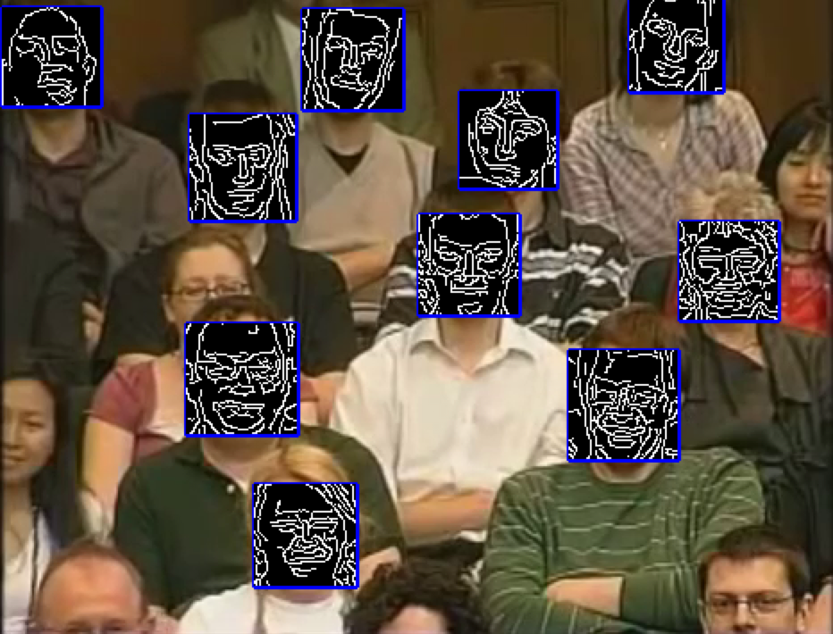
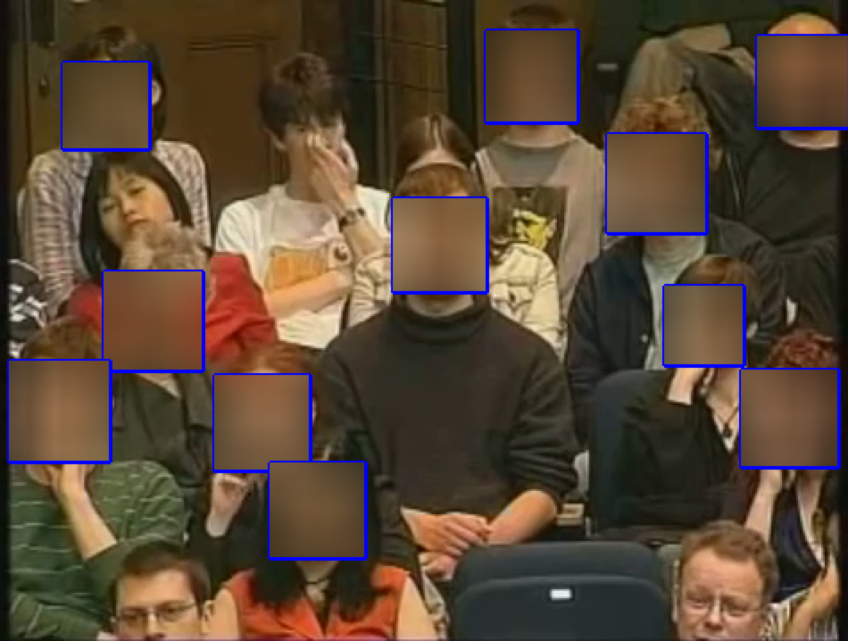

# Face Detection and Anonymization
I created a simple tool using OpenCV library which detects faces through webcam or video input and blurs them when you press 'b' and applies canny edge detection when you press 'c'. Below you can find sample screenshots on how the program behaves.
## Canny edge detection

## Blur face image

